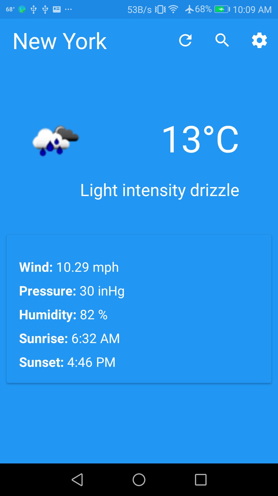
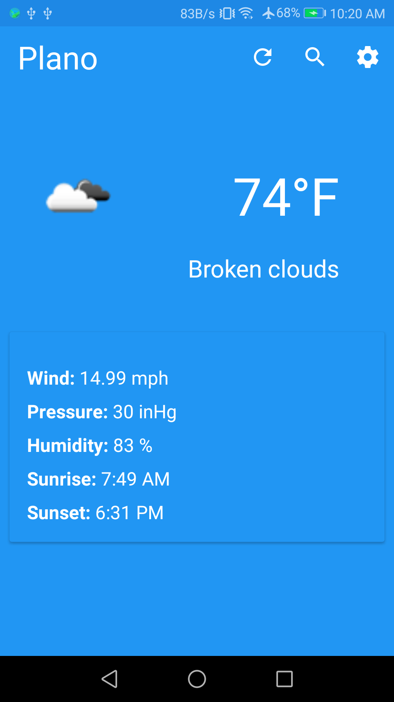
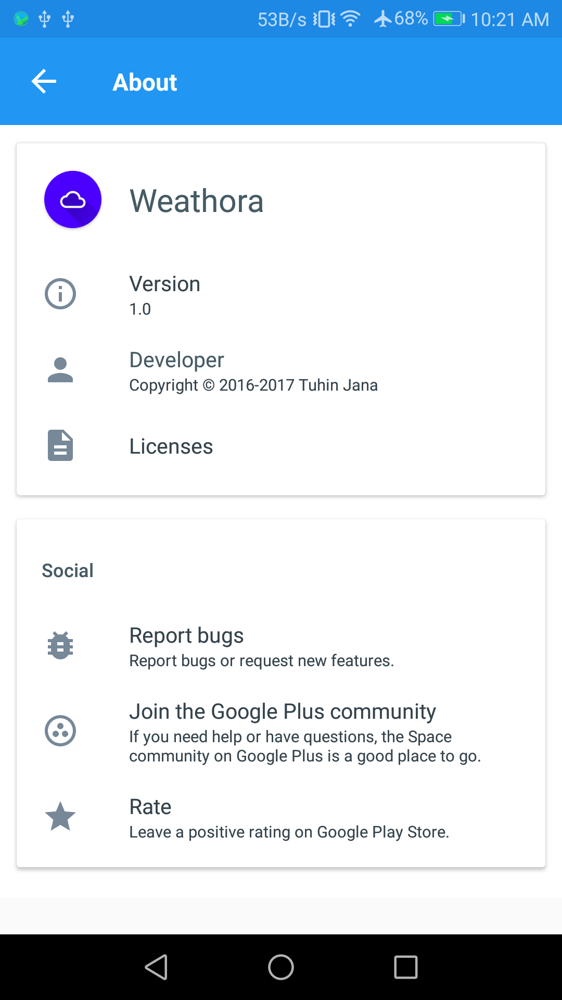

# Weathora
    
Weathora is a native android weather app for US cities. It lets users select any US city and shows the current weather details. 
It uses google places api to fecth list of US cities and openweathermap.org API to fetch the weather details of a given city. 
It also auto loads the last city searched upon app launch.

## Requirements

Android SDK 16+

## Screenshots

  | Home Celsius   | Search    |
  | :-------------:|:-------------: | 
  |  |  |

| Home Fahrenheit     | About     |
| :-------------: | :-------------: | 
|  |  |

## Libraries

Usage of libraries: 
   * [Butterknife](https://github.com/JakeWharton/butterknife) - for view Injection  
   * [RxJava 2, RxAndroid 2](https://github.com/ReactiveX/RxJava) - for data manipulation 
   * [Glide](https://github.com/bumptech/glide) - for image loading 
   * [Gson](https://github.com/google/gson) - for serialization and deserialization 
   * [Retrofit2](https://github.com/square/retrofit) - for HTTP requests  
   * [Leak canary](https://github.com/square/leakcanary) - for memory leak detection  

## TODO
  * Add Dagger2 for dependency injection
  * Improve overall UI as per material design guideline
  * Improve weather icon quality, icon http://openweathermap.org/img/w/ api provides is of very low quality.

## Bug report?

Please open an issue. Screenshots are also a huge help if the problem is visual.

If you're fixing a bug, Send a pull request!
